# Mason Brick Tracking — System Architecture

> Single source of truth for the entire RFID brick-tracking system.  
> Consolidates all prior documentation into one file with visual diagrams.

---

## Table of Contents

1. [System Overview](#1-system-overview)
2. [Scan Pipeline](#2-scan-pipeline)
3. [Data Model](#3-data-model)
4. [Backend API](#4-backend-api)
5. [Dashboard](#5-dashboard)
6. [Multi-Mason Concurrency](#6-multi-mason-concurrency)
7. [UPSERT & Duplicate Prevention](#7-upsert--duplicate-prevention)
8. [History & Audit Trail](#8-history--audit-trail)
9. [Field Tuning Parameters](#9-field-tuning-parameters)
10. [Testing Guide](#10-testing-guide)
11. [Deployment & Operations](#11-deployment--operations)

---

## 1. System Overview


### Tech Stack

| Layer | Technology | Key Files |
|-------|-----------|-----------|
| RFID Hardware | Chainway MR20 UHF, BLE | `DeviceAPI_ver20250209_release.aar` |
| Android App | Java, Room, Retrofit2, SDK 27-34 | `MainActivity.java` (1092 lines) |
| Backend | Node.js, Express, SQLite3, bcrypt | `server.js` (957 lines), `db.js` (791 lines) |
| Dashboard | HTML, Chart.js, Leaflet, DBSCAN | `dashboard.html` (2001 lines) |

---

## 2. Scan Pipeline

```mermaid
sequenceDiagram
    participant M as Mason (Physical Button)
    participant SDK as RFID SDK
    participant CW as Capture Window (350ms)
    participant PROC as processCaptureWindow()
    participant DUP as Duplicate Check
    participant DB as Room DB → Server

    M->>SDK: Press scanner button
    SDK->>CW: callback(UHFTAGInfo tag)
    Note over CW: Accumulates all reads<br/>for 350ms

    loop Every tag read in window
        SDK->>CW: EPC + RSSI + timestamp
    end

    CW->>PROC: Window closes → evaluate candidates

    alt Clear Winner (RSSI gap > 5dB)
        PROC->>DUP: Winner EPC selected
    else Ambiguous (within 5dB & 1 count)
        PROC-->>M: "Ambiguous - Rescan" (rejected)
    else No reads
        PROC-->>M: "No tag detected"
    end

    DUP->>DUP: Check 500ms cooldown
    DUP->>DUP: Check GPS distance + time
    DUP->>DUP: Check session duplicates

    alt Passes all checks
        DUP->>DB: Save BrickPlacement<br/>(EPC, RSSI, GPS, session, seq)
        DB-->>M: Counter incremented
    else Duplicate detected
        DUP-->>M: Silently discarded
    end
```



### Pipeline Steps

| Step | What Happens | Key Constants |
|------|-------------|---------------|
| 1. Button Press | SDK fires `callback(UHFTAGInfo)` | — |
| 2. Capture Window | Accumulates all reads for window duration | `captureWindowMs = 350` |
| 3. Winner Selection | Highest read count, tie-break by avg RSSI | `rssiAmbiguityThresholdDb = 5` |
| 4. Ambiguity Check | Reject if top-2 within threshold | `countAmbiguityThreshold = 1` |
| 5. Cooldown Check | Per-tag minimum interval | `SCAN_COOLDOWN_MS = 500` |
| 6. GPS Duplicate Check | Same tag + nearby location + recent time | `DUPLICATE_TIME = 5min, DISTANCE = 10m` |
| 7. Session Duplicate Check | Already scanned in this START→STOP session | `scannedTagsInSession` HashSet |
| 8. Persist & Sync | Room DB insert → immediate HTTP sync | `SYNC_THRESHOLD = 1` |

---

## 3. Data Model

### 3.1 Android Entity: BrickPlacement


### 3.2 Backend Database Schema


### 3.3 Database Indexes

```sql
CREATE INDEX idx_mason_id ON placements(mason_id);
CREATE INDEX idx_timestamp ON placements(timestamp DESC);
CREATE INDEX idx_mason_timestamp ON placements(mason_id, timestamp DESC);
CREATE INDEX idx_event_id ON placements(event_id);
CREATE INDEX idx_session_seq ON placements(build_session_id, event_seq);
```

---

## 4. Backend API

### 4.1 Endpoint Map


### 4.2 Core Sync Endpoint

**POST `/api/placements/sync`**

```
Request:
{
  "masonId": "MASON_001",
  "placements": [{
    "brickNumber": "E28011B0A50500768C7FB6D2",
    "timestamp": 1769113871044,
    "latitude": 43.002773,
    "longitude": -77.470458,
    "altitude": 10.5,
    "accuracy": 2.4,
    "buildSessionId": "550e8400-e29b-41d4-a716-...",
    "eventSeq": 5,
    "rssiAvg": -45,
    "rssiPeak": -40,
    "readsInWindow": 3,
    "powerLevel": 33,
    "decisionStatus": "ACCEPTED"
  }]
}

Response:
{
  "success": true,
  "message": "Synced 1 placements",
  "lastPlacementNumber": 27,
  "inserted": 1,
  "updated": 0,
  "duplicatesSkipped": 0
}
```

### 4.3 Statistics Endpoint

**GET `/api/statistics/efficiency?masonId=MASON_001`**

Returns per-mason daily stats, hourly distributions, average bricks/hour.

### 4.4 History Endpoint

**GET `/api/history/brick/:brickNumber`**

Returns the complete audit trail for a brick — all current + archived scans in chronological order. Each record tagged as `CURRENT` or `HISTORY`.

---

## 5. Dashboard

### 5.1 Overview Tab

| Component | Data Source | Refresh |
|-----------|-----------|---------|
| Total Placements card | `/api/statistics/efficiency` | 10s |
| Active Masons card | `/api/statistics/efficiency` | 10s |
| Avg Bricks/Hour card | `/api/statistics/efficiency` | 10s |
| Best Day card | `/api/statistics/efficiency` | 10s |
| Live Timeline (Chart.js) | `/api/placements/recent` | 10s |
| Daily Bar Chart | `/api/statistics/efficiency` | 10s |
| Live Placement Log | `/api/placements/recent` | 1s |

### 5.2 Map Tab

- **Leaflet + OpenStreetMap** tiles
- Individual brick dots colored per-mason
- **DBSCAN wall clustering**: ε=10m, minPoints=3, 24hr window
- **Direction splitting**: 45° threshold for perpendicular wall detection
- **Multi-mason wall detection**: "TEAM" badges when 2+ masons work same wall
- Polygons drawn around clustered placements

### 5.3 Performance Review

Opens modal → generates HTML report via `reportGenerator.js`:
- Summary stats (total placements, avg/hour, GPS quality)
- Daily chart + hourly distribution
- Full daily performance table

---

## 6. Multi-Mason Concurrency


**Key guarantees:**
- SQLite serializes writes automatically (single writer lock)
- Each sync is a single atomic transaction
- Per-mason counters are independent
- Cross-mason duplicate detection (same brick within 5 min → rejected)
- Dashboard mason selector filters per-mason data

---

## 7. UPSERT & Duplicate Prevention

### Three-Level Duplicate Detection


### UPSERT Rules

| Scenario | Result | Counter |
|----------|--------|---------|
| New brick, new mason | INSERT | +1 |
| Same brick, same mason, < 30s | REJECTED | unchanged |
| Same brick, same mason, > 30s, better data | UPDATE (archive old) | unchanged |
| Same brick, same mason, > 30s, worse data | REJECTED | unchanged |
| Same brick, different mason, < 5 min | REJECTED (cross-mason) | unchanged |
| Same brick, different mason, > 5 min | INSERT (new mason's copy) | +1 for new mason |

---

## 8. History & Audit Trail

### Two-Table Design

- **`placements`** — Current/latest state per brick per mason. Fast queries.
- **`placement_history`** — Append-only archive. Every prior state preserved.

### Brick Journey Example

```
Scan 1 (Pallet, accuracy 15m):
  → INSERT into placements | Counter = 1

Scan 2 (Moved to wall, accuracy 3m, 2 min later):
  → Archive Scan 1 to placement_history
  → UPDATE placements with Scan 2
  → Counter still 1

Scan 3 (Final position, accuracy 2m, 5 min later):
  → Archive Scan 2 to placement_history
  → UPDATE placements with Scan 3
  → Counter still 1

Result: placements has 1 row (final state)
        placement_history has 2 rows (prior states)
        API returns all 3 chronologically
```

---

## 9. Field Tuning Parameters

These constants can be adjusted on-site without rebuilding the app:

| Parameter | Default | Range | Effect |
|-----------|---------|-------|--------|
| `captureWindowMs` | 350ms | 250-500ms | Longer = more reads, slower response |
| `rssiAmbiguityThresholdDb` | 5 dB | 3-7 dB | Lower = stricter, more "Ambiguous" rejections |
| `countAmbiguityThreshold` | 1 | 0-2 | Lower = only exact count ties check RSSI |
| `SCAN_COOLDOWN_MS` | 500ms | 200-1000ms | Per-tag minimum re-read interval |
| `DUPLICATE_TIME_THRESHOLD` | 5 min | 1-15 min | GPS duplicate detection time window |
| `DUPLICATE_DISTANCE_THRESHOLD` | 10m | 2-20m | GPS duplicate detection distance |

### Recommended Presets

| Environment | Window | RSSI Threshold | Count Threshold |
|-------------|--------|----------------|-----------------|
| Indoor, clean | 250ms | 3 dB | 1 |
| Outdoor, open | 350ms | 5 dB | 1 |
| High tag density | 400ms | 6 dB | 2 |
| Wet / moisture | 500ms | 7 dB | 2 |

---

## 10. Testing Guide

### Quick Validation Checklist

| # | Test | Expected | Status |
|---|------|----------|--------|
| 1 | Login as mason1 | Token + MASON_001 returned | |
| 2 | Scan first brick | Counter = 1, dashboard shows 1 | |
| 3 | Rescan same brick < 30s | Rejected (too recent), counter = 1 | |
| 4 | Rescan same brick > 30s with better GPS | Updated, counter still 1 | |
| 5 | Scan different brick | Counter = 2 | |
| 6 | Mason2 scans mason1's brick < 5 min | Cross-mason conflict rejected | |
| 7 | Offline scan + reconnect | Auto-syncs, counter updates | |
| 8 | Check history API | All scans in chronological order | |
| 9 | Dashboard map clusters bricks | Walls appear as polygons | |
| 10 | Performance report generates | HTML report with charts | |

### Backend API Test Commands

```powershell
# Login
curl -X POST http://localhost:8080/api/auth/login `
  -H "Content-Type: application/json" `
  -d '{"username":"mason1","password":"password123"}'

# Sync a placement
curl -X POST http://localhost:8080/api/placements/sync `
  -H "Content-Type: application/json" `
  -d '{"masonId":"MASON_001","placements":[{"brickNumber":"TEST-001","timestamp":1700000000000,"latitude":40.71,"longitude":-74.00,"accuracy":5.0}]}'

# Check count
curl http://localhost:8080/api/placements/last?masonId=MASON_001

# View efficiency stats
curl http://localhost:8080/api/statistics/efficiency?masonId=MASON_001

# Brick history
curl http://localhost:8080/api/history/brick/TEST-001
```

### Database Debug Queries

```sql
-- Check all placements for a mason
SELECT mason_id, COUNT(*), MAX(datetime(timestamp/1000, 'unixepoch')) as last_scan
FROM placements GROUP BY mason_id;

-- Find GPS-missing scans
SELECT COUNT(*), decision_status FROM placements
WHERE accuracy = 999.0 GROUP BY decision_status;

-- Power vs RSSI analysis
SELECT power_level, AVG(rssi_avg) as avg_rssi, COUNT(*) as scans
FROM placements WHERE power_level > 0
GROUP BY power_level ORDER BY power_level;

-- Verify schema
PRAGMA table_info(placements);
```

---

## 11. Deployment & Operations

### First-Time Setup

```bash
# 1. Backend
cd backend
npm install
node server.js
# Creates mason_tracking.db, default users: mason1, mason2, admin

# 2. Android App
# Open MasonBrickTracking/ in Android Studio
# Update BASE_URL in ApiClient.java to your server IP
# Build → Install on device

# 3. Dashboard
# Open browser to http://<server-ip>:8080/dashboard.html
```

### Multi-Machine Development

```bash
# Clone repo
git clone https://github.com/TwoSpheresOneCylinder/RFID_Scanner-Mason_productivity.git

# Backend dependencies (NOT checked into git)
cd backend && npm install

# Android: open in Android Studio, Gradle will sync automatically
```

### Default Credentials

| Username | Password | Mason ID |
|----------|----------|----------|
| mason1 | password123 | MASON_001 |
| mason2 | password123 | MASON_002 |
| admin | admin123 | MASON_ADMIN |

### File Structure

```
MasonBrickTracking/
├── app/
│   ├── build.gradle
│   ├── libs/
│   │   └── DeviceAPI_ver20250209_release.aar
│   └── src/main/
│       ├── AndroidManifest.xml
│       ├── assets/BatteryPercentages/    # Battery icons
│       ├── java/com/mason/bricktracking/
│       │   ├── ui/
│       │   │   ├── MainActivity.java     # Main scanning activity
│       │   │   ├── LoginActivity.java
│       │   │   ├── ConnectionActivity.java
│       │   │   └── DeviceListActivity.java
│       │   ├── data/
│       │   │   ├── model/BrickPlacement.java
│       │   │   ├── local/AppDatabase.java
│       │   │   └── remote/ApiClient.java
│       │   ├── sync/SyncManager.java
│       │   └── service/BatteryTestService.java
│       └── res/layout/
│           └── activity_main_brick.xml
├── backend/
│   ├── server.js              # Express API server
│   ├── db.js                  # SQLite init + queries
│   ├── reportGenerator.js     # HTML performance reports
│   ├── public/dashboard.html  # Web dashboard
│   ├── package.json
│   └── package-lock.json
├── build.gradle               # Root Gradle config
├── settings.gradle
├── gradle/
├── README.md
└── ARCHITECTURE.md            # ← This file
```

---

*Last updated: 2026-02-05 — v1.0 repo cleanup*
